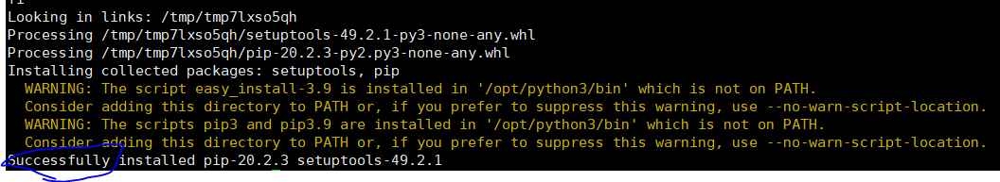
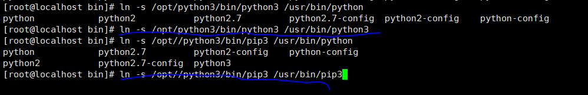

# python-study
this is the first project of mine

### Windows下安装python3

#### 下载链接

```
https://www.python.org/downloads/windows/
安装方式就一路点击下一步即可，会自动将python3添加到环境变量中
```

### Linux下安装python3

#### 下载链接

```
https://www.python.org/ftp/python/
```

#### 安装方式

1、下载对应版本的安装包，这次下载的是3.9.2版本，点击对应版本即可


2、在Linux下安装的话，选择这个Python-3.9.2.tgz，右键点击，复制下载链接


3、在Linux上执行

```
wget https://www.python.org/ftp/python/3.9.2/Python-3.9.2.tgz
```


4、解压安装包

```
tar xvf Python-3.9.2.tgz
```


5、进入解压后的目录

```
cd Python-3.9.2
```


6、安装依赖包

```
yum -y install gcc patch libffi-devel python-devel  zlib-devel bzip2-devel openssl-devel ncurses-devel sqlite-devel readline-devel tk-devel gdbm-devel db4-devel libpcap-devel xz-devel
```


7、设置安装路径

```
 ./configure --prefix=/opt/python  --with-ssl
```


8、安装python3

```
make && make install
```


这样就是安装成功了



9、配置环境变量

```
ln -s /opt/python3/bin/python3 /usr/bin/python3
ln -s /opt/python3/bin/pip3 /usr/bin/pip3
```



10、修改pip安装源

```
vim ~/.pip/pip.conf
```

```conf
[global]
index-url = https://mirrors.aliyun.com/pypi/simple
```

